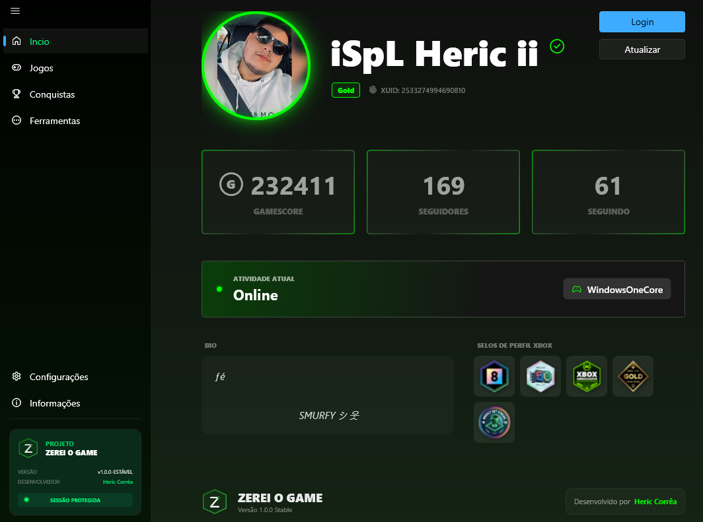
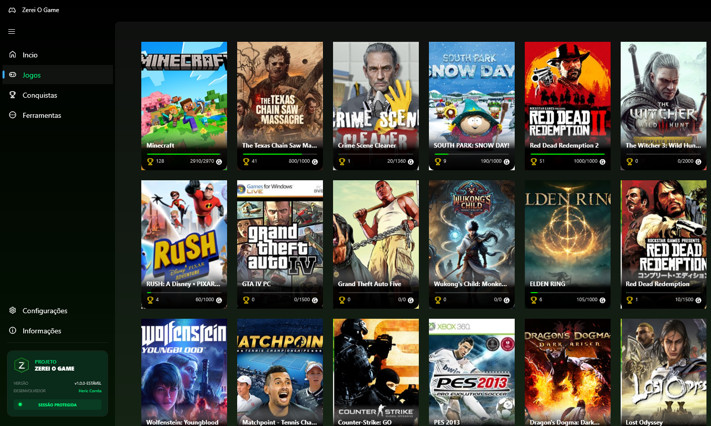
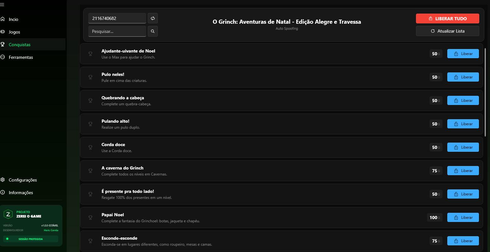

# Zerei o Game — Xbox Achievement Unlocker (XAU) / BRAZIL DIVISION
O **Zerei o Game** é uma ferramenta de alta performance desenvolvida em **.NET 9** para entusiastas e jogadores de Xbox. Este aplicativo combina um gerenciador de autenticação robusto com funcionalidades avançadas de simulação e gerenciamento de conquistas.

## Preview do Aplicativo

  
  

  
  

---

## Créditos e Origem
* **Base Técnica:** Este projeto utiliza como base o aplicativo **XAU**, originalmente criado pelo desenvolvedor **Draff**.
* **Evolução:** Com base nessa referência, desenvolvemos o **Zerei o Game** como uma versão aprimorada, focada em evolução constante, melhorias de interface e performance otimizada.

## Aviso sobre o Windows Defender:**
Por ser um software independente e não possuir uma assinatura digital paga, o Windows SmartScreen pode exibir o alerta "O Windows protegeu o computador".
* Este é um comportamento padrão para executáveis novos de código aberto.
* O aplicativo é seguro e focado exclusivamente em funções de Xbox.
* Para abrir, clique em **"Mais informações"** e selecione **"Executar assim mesmo"**.
  
## Funcionalidades Principais
* **Simulação de Gameplay**: Capacidade de simular que você está jogando qualquer título, mesmo sem possuir o jogo.
* **Desbloqueio de Conquistas**: Permite o desbloqueio direto de conquistas, mesmo em jogos nunca jogados anteriormente.
* **Autenticação Xbox**: Fluxo simplificado e estável para gerenciamento de tokens de serviços Xbox.
* **Portabilidade Total**: Executável autossuficiente (Single-File) que dispensa instalação.
* **Interface Moderna**: UI baseada em Fluent Design, integrada ao visual do Windows 11.
* **Performance Otimizada**: Compilado com tecnologia **ReadyToRun** para inicialização instantânea.

## Especificações Técnicas
* **Linguagem:** C# 13
* **Framework:** .NET 9.0 (WPF)
* **Target Runtime:** win-x64
* **Arquitetura:** Padrão MVVM (Model-View-ViewModel).

## Como utilizar
1. Acesse a aba **Releases** no topo deste repositório.
2. Baixe o arquivo executável `Zerei_o_Game.exe`.
3. **Importante**: Execute sempre como **Administrador** para garantir o funcionamento das APIs de rede e segurança.
  

  

  Clique no botão acima para ser redirecionado à área de downloads oficial.

